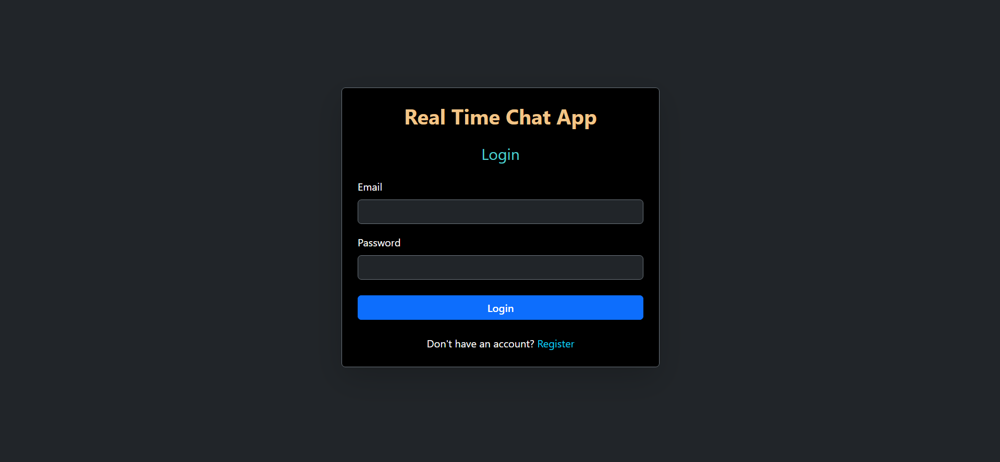

# Real-Time Chat App 💬

A modern, full-stack real-time chat application built with **React** (Vite) + **Node.js/Express** + **Socket.io** + **MongoDB**.




## ✨ Features

- ✅ **Real-time messaging** using Socket.io
- ✅ User authentication (Register & Login)
- ✅ Private one-on-one chat
- ✅ Secure password hashing with bcrypt
- ✅ JWT-based authentication
- ✅ Responsive UI with Bootstrap
- ✅ Live user connection status

## 🛠️ Tech Stack

### Frontend
- **React 19** + **Vite**
- **React Router DOM**
- **Socket.io Client**
- **Axios** for API calls
- **Bootstrap 5** + Bootstrap Icons
- **React Hot Toast** for notifications

### Backend
- **Node.js** + **Express**
- **Socket.io**
- **MongoDB** with **Mongoose**
- **JWT** for authentication
- **bcryptjs** for password security
- **CORS** enabled

---

## 🚀 Getting Started

### Prerequisites
- Node.js (v18+)
- MongoDB (local or MongoDB Atlas)
- Git

### 1. Clone the Repository
```bash
git clone https://github.com/Its33shubh/RealTime-chat-app.git
cd RealTime-chat-app
